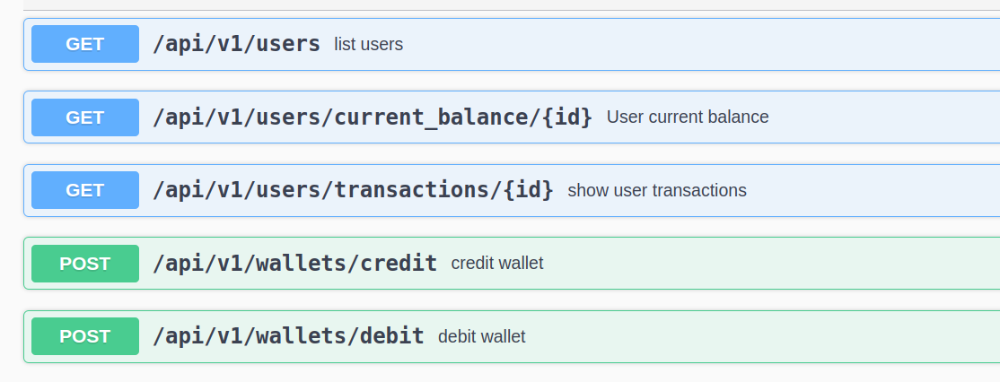

## 💻 Project

Backend for SlateFX

## 🚀 Tech Stack

- Ruby 3.2.0
- Rails 7.0.4
- PostgreSQL
- Hotwire - (Turbo e Stimulus)
- Tailwind CSS
- Importmap
- Gem: Devise
- Gem: Rspec
- Gem: Factory_bot
- Gem: Rswag - Swagger
- Gem: Active model serializers


## 💥 Functionality

**WEB**
- [x] Login - Admin
- [x] CRUD for USER
- [x] Credit or Debit user account
- [x] Transaction Histor

**API**
- [x] GET: List user
- [x] GET: User Balance
- [x] GET: User Transactions
- [x] POST: Credit user account
- [x] POST: Debit user account

## ⚡ Install

```bash

git clone git@github.com:GeorgePires/virtual-wallet.git

# entre no diretório clonado
cd Slate_API

# instalar dependências do Ruby on Rails
bundle install

# instalar dependências do Node
npm install

# criar os bancos de dados e adicionar admin e user
rails dev:setup

```
```bash
# Admin generated credential
    - Admin: admin@gmail.com | Password: 123246
```
```bash
# Execute Projects
./bin/dev 

http://localhost:3000
```
## 🔰 API SlateFX

```bash
# Swagger
- http://localhost:3000/api-docs
```
<div align="center">
    
</div>
<br>